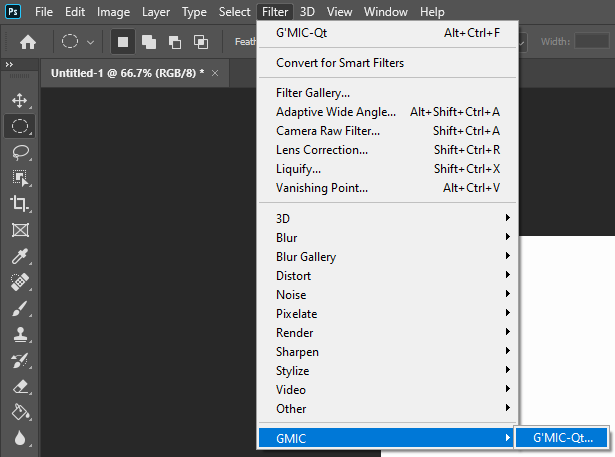
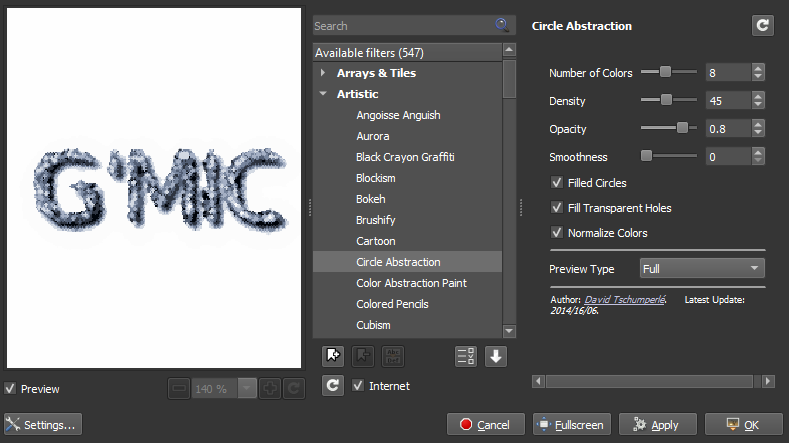
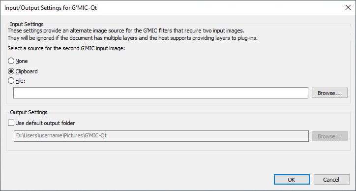

# gmic-8bf

A filter plug-in for Adobe® Photoshop®* and other compatible software that interacts with [G'MIC-Qt](https://github.com/c-koi/gmic-qt).

The latest version can be downloaded from the [Releases](https://github.com/0xC0000054/gmic-8bf/releases) tab.

### System Requirements

* Windows* 7, 8 or 10.
* A compatible 32-bit or 64-bit host application.

## Installation

1. Close your host application.
2. Place GmicPlugin.8bf and gmic folder in the folder that your host application searches for filter plug-ins.
3. Restart your host application.
4. The plug-in will now be available as the G'MIC-Qt menu item in the GMIC category.

### Installing in Specific Hosts

The gmic-8bf project wiki provides installation instructions for several popular hosts.

Affinity Photo: [Installing in Affinity Photo](https://github.com/0xC0000054/gmic-8bf/wiki/Installing-in-Affinity-Photo)   
Photoshop: [Installing in Photoshop](https://github.com/0xC0000054/gmic-8bf/wiki/Installing-in-Photoshop)       
XnView: [Installing in XnView](https://github.com/0xC0000054/gmic-8bf/wiki/Installing-in-XnView)   

### Updating

Follow the installation instructions above and allow any existing files to be replaced. 

## Usage

To start the plug-in select the G'MIC-Qt item in the filter list of your host application.
The following image shows the menu location in Adobe Photoshop.



### G'MIC-Qt

When the *G'MIC-Qt* menu item is clicked it will start the G'MIC-Qt user interface.



While the plug-in supports the Grayscale image modes, many G'MIC effects will only work correctly in the RGB image modes
(e.g. the various Colorize effects).
When the G'MIC plug-in is run in the Grayscale image modes any RGB images that G'MIC creates will be converted to Grayscale
when they are returned to the host.

You can "layer" multiple G'MIC effects in a single session by clicking the Apply button.
Note that only the most recently applied effect will be used when the plug-in is invoked
through the "Last Filter" or "Repeat Filter" commands.

Filters that require multiple input images can only be used if the input settings have been configured to provide a
second input image or the document has multiple layers and the host supports providing layers to the plug-in.
Document layers are provided to plug-ins by Adobe Photoshop CS (8.0) and later (and possibly other Adobe applications), but 3rd-party
hosts will most likely not support this feature due to the license restrictions added to the Photoshop SDK after version 6.0.

If the user has not configured a default output folder the plug-in will prompt the user to save the modified images after the
G'MIC-Qt dialog has been closed in the following cases:

1. When a filter produces multiple output images the plug-in will prompt the user for a folder to copy them into.
2. When a filter changes the image size the plug-in will prompt the user to save the resized image.

### Input/Output Settings for G'MIC-Qt

When the *Input/Output Settings for G'MIC-Qt* menu item is clicked it will start the Input/Output Settings for G'MIC-Qt user interface.



#### Input Settings

This section allows a second input image to be sent to G'MIC-Qt for the filters that require one.
The settings in this section will be ignored if the document has multiple layers and the host supports providing layers to plug-ins.

You can choose from one of the following options:

* None (default)
  * The plug-in will only use the document layers for additional input images.
* Clipboard
  * The plug-in will look for a second input image on the operating system clipboard.
* File
  * The plug-in will use the specified image as the second input image.

#### Output Settings

This section allows users to set a default output folder for filters that produce multiple output images or resizes the output image.
The output folder should default to a G'MIC-Qt folder in your Pictures folder, but it can be changed to any folder.   
When this option is configured the plug-in will copy the output image(s) to the specified folder without prompting the user.
A prompt will still be shown if there was an error loading the default folder setting.

## License

This project is licensed under the terms of the MIT License.   
See [License.txt](License.txt) for more information.

# Source code

## Prerequisites

* Visual Studio 2019
* The `boost-filesystem`, `boost-endian`, `boost-predef`, `boost-process`, `LibPNG` and `OpenEXR` packages from [VCPkg](https://github.com/microsoft/vcpkg).
* The Adobe Photoshop CS6 SDK, see the read-me in the ext folder for more details.

## Building the plug-in

* Open the solution in the `vs` folder
* Update the post build events to copy the build output to the filters folder of your host application
* Build the solution

```
* Adobe and Photoshop are either registered trademarks or trademarks of Adobe Systems Incorporated in the United States and/or other countries.
 Windows is a registered trademark of Microsoft Corporation in the United States and other countries.   
 All other trademarks are the property of their respective owners.
```

